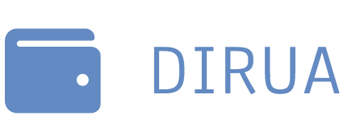

# Dirua

## 

## Contents

- [Introduction](#introduction)
- [Features](#features)
- [Contributing](CONTRIBUTING.md)
- [LICENSE](LICENSE)

## Introduction

Dirua is a universal crypto wallet. It was developed with a mobile-first mindset. It was also developed using front-end technologies to interact with P2P crypto networks making Dirua a distributed app.

## Features

- **Mobile first**: Dirua's objective on a mobile-first product aims at making crypto payments a friendly task. Having access to the user's crypto wallets right from their mobile device and being able to send payments on the spot will help this technologies reach a wider audience.
- **QR Scan**: Dirua's QR scanning features provide a user friendly approach to:
  - Importing wallets using **WIF**
  - Reading **public addresses** for payments and/or adding them to your **address book**.
- **Unlimited** universal wallets for different use cases (eg. personal, work and/or family accounts).
- **Address Book**: Dirua offers the user the tools to maintain a list of the most commonly used addresses for quick access when sending payments.
- **P2P identity**: Dirua does not have a sign up form, nor does it store any user data on any of our servers. Dirua provides a mechanism for the users to sign in and use the app via [Blockstack](https://blockstack.org/t). Blockstack provides the identity layer for this distributed app (you can read more about it here: [Blockchain identity](https://blockstack.org/posts/blockchain-identity)).
- **Data storage**: Dirua uses Blockstack's tools to store the user's data. Blockstack provides a mechanism for users to control their data by setting up their own storage provider (you can read more about it here: [Gaia](https://github.com/blockstack/gaia)).
- **Distributed app**: Dirua's technology makes it possible to interact with the different crypto networks without having to run full nodes yourself.
- **Crypto currencies available**: _Bitcoin, Bitcoin cash, Litecoin, Dash, Ethereum, Aragon, FirstBlood, Basic Attention, Bancor, Civic, district0x, Edgeless, Eos, Gnosis, Golem, Matchpool, Numeraire, OmiseGo, Qtum, Augur, RCN (RipioCreditNetwork), iExec RLC, Salt, Status, Storj, Swarm City, TrustCoin/WeTrust, Wings, 0x_ and more are coming.
- **Custom ERC20 tokens**: Dirua provides a mechanism to import newly created tokens on the Ethereum network. This way new communities can take advantage of Dirua's features.
- **Cross wallet exchange**: Dirua provides a mechanism to send payments from a withdrawal wallet to a deposit wallet that hold different crypto currencies or tokens. This is done using [ShapeShift](https://shapeshift.io/). E.g. you could send ETH by having BTC funds, or any other combination with the currencies Dirua supports.

## Testnet

Dirua provides a version of the app that connects to the _testnet_ nodes of the different communities to test out the interface. Please note, in-wallet exchange features will not work as Shapeshift only works with transactions on _livenet_ nodes.

The testnet version can be found here: (Dirua @ Testnet)[https://testnet.dirua.exchange].

## License

Dirua is available under the [MIT License](https://github.com/citrusbyte/universal-wallet/blob/master/LICENSE).

## About Citrusbyte

This software is lovingly maintained and funded by Citrusbyte.
At Citrusbyte, we specialize in solving difficult computer science problems for startups and the enterprise.

At Citrusbyte we believe in and support open source software.
* Check out more of our open source software at Citrusbyte Labs.
* Learn more about [our work](https://citrusbyte.com/portfolio).
* [Hire us](https://citrusbyte.com/contact) to work on your project.
* [Want to join the team?](http://careers.citrusbyte.com)

*Citrusbyte and the Citrusbyte logo are trademarks or registered trademarks of Citrusbyte, LLC.*
